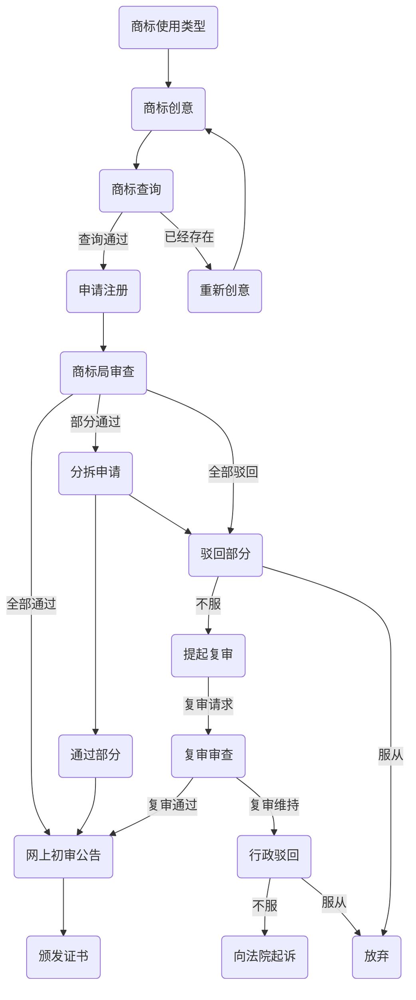

> 流程图无法看清，可以左下角替换页面为浅色主题

```mermaid
graph TB;
    A(商标使用类型)-->B(商标创意);
    B-->C(商标查询);
    C--查询通过-->D(申请注册);
    C--已经存在-->E(重新创意);
    E-->B;
    D-->F(商标局审查);
    F--全部通过-->G(网上初审公告)
    G-->H(颁发证书);
    F--部分通过-->I(分拆申请);
    I-->J(通过部分);
    I-->K(驳回部分);
    J-->G;
    K--不服-->L(提起复审);
    K--服从-->M(放弃);
    F--全部驳回-->K;
    L--复审请求-->O(复审审查);
    O--复审通过-->G;
    O--复审维持-->P(行政驳回);
    P--不服-->Q(向法院起诉);
    P--服从-->M;
```

